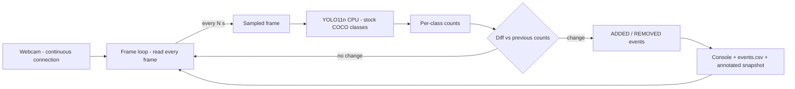

# Storage Unit Item Detection — MVP

Watches a storage unit through a webcam, detects the items in view with
pretrained YOLO (stock COCO classes, CPU-only), and logs an event whenever an
item is **added** or **removed** — determined by per-class count diffs between
frames sampled every few seconds from the continuous video connection.

## Setup

```
py -3.12 -m venv .venv
.venv\Scripts\activate
pip install -r requirements.txt
```

First run auto-downloads `yolo11n.pt` (~5.4 MB). Torch (~200 MB) is the slow
part of the install.

## Usage

```
python watcher.py                  # defaults: camera 0, sample every 5 s
python watcher.py --show           # + live preview and detection windows
python watcher.py --interval 10 --conf 0.4
```

Flags: `--interval` (s between samples), `--conf` (YOLO confidence),
`--model`, `--camera`, `--imgsz`, `--logdir`, `--show`.

## How it flows



## Output

`logs/events.csv` (created on first run):

```
timestamp,event,class,delta,prev_count,new_count
2026-07-23T14:05:10,BASELINE,bottle,2,0,2
2026-07-23T14:05:20,ADDED,cup,1,0,1
2026-07-23T14:05:35,REMOVED,bottle,-1,2,1
```

Annotated snapshots land in `logs/snapshots/` on the baseline sample and on
every sample that produced an event.

## Known limitations (MVP-by-design)

- Stock COCO classes only — there is **no "box" class**; suitcase/backpack/
  handbag act as stand-ins until Part B custom training.
- A flickered detection produces a false ADDED/REMOVED pair (hysteresis is
  Part B). Equal-count swaps between samples are invisible. Lighting
  sensitivity untested.

## Layout

```
watcher.py            capture → detect → diff → log (single file)
```
