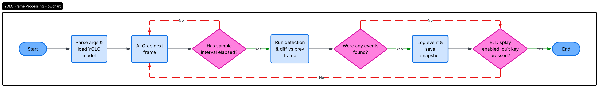

# Automatic Inventory Tracking w/ CV

This computer vision project is built upon a Tartanhacks project built in 2025.

This is a minimum viable product to showcase the potential of using a Computer vision program for tracking items in storage. 

## Overview

As the startup grows, tracking all items in storage will become increasingly difficult. This project will replace slow manual checks with cameras that automatically detect inventory changes, improving accuracy, reducing labor costs, and providing real-time visibility into stock levels.

## How it Works

## Features

- Real-time detection
- Lightweight & Fast
- Change detection

## Restrictions/limitations
- Requires clear, stable camera feed
- Running on YOLO11n, Items outside scope of pre trained model will not be recognized
- Utilizing CPU

## Next Steps
- Expand detection classes to support wide range of items Company has
- Connect with tracker for real-time updates to inventory
- Build a UI for ease of use by non-technical staff
- Support multiple cameras
- Improve accuracy in unstable environments (e.g. low-light, clusted items, )
- Automatic notifications when invenotry stock falls below threshold
- Determine the best deployment strategy
- Create custom-trained model on specific inventory, rather than relying on a general pretrained model

## Tech Stack
- Python 
- YOLO (Ultralytics)
- OpenCV

## Contributing
This project is curerntly being developed for internal use, to contribute or suggest improvements, open a issue or submit a pull request.

## Contact
Misael Ventura

