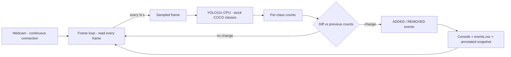

# Storage Unit CV — Part A MVP: Implementation Spec

Refined from the outline plan via Ultraplan. Master plan: `docs/source-plan.md`
(Part A = this MVP, due Thursday evening 2026-07-23; Part B = post-MVP roadmap,
**strictly out of scope here** — see final section).

**Working mode (updated):** Claude delivers skeleton files with step-by-step
pseudocode for the CV parts (`watcher.py`, `tests/test_events.py`); the user
implements them hands-on, returning to the session only when stuck.
`deck/build_deck.py` and `README.md` are Claude-written working code/docs
(presentation boilerplate, no CV learning value). This doc is the reference
manual for the hand-implementation.

---

## 1. Environment & setup

Already done in this repo, recorded for reproducibility:

```
py -3.12 -m venv .venv          # Python 3.12 — safest torch/ultralytics wheels
.venv\Scripts\activate          # (PowerShell: .venv\Scripts\Activate.ps1)
pip install -r requirements.txt
```

`requirements.txt` (exact contents):

```
ultralytics
opencv-python
python-pptx
pytest
```

Notes:
- First `YOLO("yolo11n.pt")` call auto-downloads the model (~5.4 MB).
- The torch dependency (~200 MB) is the install long pole — already installed.
- Code, tests, and deck generation are OS-independent. Only the **webcam smoke
  test and staged demo run require the Windows machine with the camera**.

## 2. `watcher.py` — contract

Single file, deliberate: fastest to build and easiest to walk through
function-by-function in the presentation.

### CLI (argparse)

| Flag         | Type / default      | Meaning                                   |
|--------------|---------------------|-------------------------------------------|
| `--interval` | float, `5.0`        | Seconds between detection samples          |
| `--conf`     | float, `0.5`        | YOLO confidence threshold                  |
| `--model`    | str, `yolo11n.pt`   | Ultralytics model weights                  |
| `--camera`   | int, `0`            | OpenCV camera index                        |
| `--imgsz`    | int, `640`          | Inference image size                       |
| `--logdir`   | str, `logs`         | Output dir (`events.csv`, `snapshots/`)    |
| `--show`     | flag, off           | Live annotated preview window              |

### Functions

```
Event  — frozen dataclass: class_name: str, prev: int, new: int
         properties: delta = new - prev; kind = "ADDED" if delta > 0 else "REMOVED"

parse_args() -> argparse.Namespace
detect_counts(model, frame, conf: float, imgsz: int) -> tuple[Counter, ndarray]
    # run YOLO ONCE on one frame → ({class_name: count}, annotated frame)
    # one inference produces both outputs — never run the model twice per sample
diff_counts(prev: Counter, curr: Counter) -> list[Event]
    # PURE function — the unit-tested core. No I/O, no globals.
log_event(csv_path, timestamp, event_kind, class_name, delta, prev, new) -> None
save_snapshot(dir, annotated_frame, timestamp, reason) -> Path
main() -> int
```

### Capture loop semantics

Open the camera **once** and keep the connection (the source plan requires a
continuous video connection). `read()` every frame in a tight loop — cheap on
CPU and keeps the driver buffer fresh so samples are current — but hand a frame
to `detect_counts` only when `--interval` seconds have elapsed since the last
sample. No motion triggering (Part B).

### Event semantics

- First snapshot is the **BASELINE**: logged, but `diff_counts` is *not*
  called — baseline handling lives in `main()`, keeping `diff_counts` pure.
- From then on, each sample diffs against the previous sample's counts.
- Missing keys count as 0 — so a class appearing or vanishing entirely falls
  out of the same delta logic, no special case.
- Classes with delta 0 produce no Event. Iterate the union of class names in
  **sorted order** for deterministic output.
- One Event per class per sample (magnitude carried by `delta`, e.g. two
  bottles removed → one Event with delta −2).
- Known blind spot (accepted for MVP): equal-count swaps are invisible.

### `logs/events.csv` schema

Header written once when the file is created:

```
timestamp,event,class,delta,prev_count,new_count
```

- `timestamp`: ISO-8601 local, e.g. `2026-07-23T14:05:10`
- `event`: `BASELINE` | `ADDED` | `REMOVED`
- `delta`: signed int; arithmetic always holds: `delta = new_count - prev_count`
- BASELINE convention: one row **per class present** in the first snapshot,
  with `prev_count=0`, `new_count=count`, `delta=count`, `event=BASELINE`.
  Nothing detected at baseline → header only, no rows.

### Snapshots

Annotated frames (YOLO's plotted boxes) saved to `logs/snapshots/` as
`YYYYMMDD-HHMMSS_<reason>.jpg`, where reason is `baseline` or `event`.
Saved on the baseline sample and on every sample that produced ≥1 Event.
These become the deck's demo screenshots.

### Failure handling

- Camera fails to open → print clear error naming the index, exit code 1.
- Transient `read()` failure → warn, skip that iteration, keep looping;
  **30 consecutive** failures → give up with an error (camera unplugged).
- Ctrl+C → clean shutdown in `finally`: release capture, destroy any windows,
  exit 0.

## 3. Test plan — `tests/test_events.py`

Target: `diff_counts` (+ `Event`). Pure function — no camera, no model needed.
Cases (worked example first; the rest are skeleton TODOs):

| # | Case                              | prev → curr                          | Expect                                        |
|---|-----------------------------------|--------------------------------------|-----------------------------------------------|
| 1 | single add (worked example)       | `{bottle:1}` → `{bottle:2}`          | 1 Event: bottle, delta +1, ADDED              |
| 2 | no change                         | `{cup:1}` → `{cup:1}`                | `[]`                                          |
| 3 | single remove                     | `{cup:2}` → `{cup:1}`                | 1 Event: cup, delta −1, REMOVED               |
| 4 | delta > 1                         | `{bottle:0}` → `{bottle:3}`          | 1 Event: bottle, delta +3                     |
| 5 | simultaneous add+remove, 2 classes| `{cup:1,book:1}` → `{cup:2,book:0}`  | 2 Events: book −1, cup +1 (sorted order)      |
| 6 | class newly appears               | `{}` → `{backpack:1}`                | 1 Event: backpack +1 (missing key = 0)        |
| 7 | class fully disappears            | `{backpack:1}` → `{}`                | 1 Event: backpack −1                          |
| 8 | empty ↔ empty                     | `{}` → `{}`                          | `[]`                                          |

Baseline is the caller's job, so there is no baseline test on `diff_counts`
itself — the convention is asserted implicitly by case 6/7 semantics.

## 4. Flow diagram



Same diagram appears in `README.md` and, as native editable shapes, on deck
slide 3.

## 5. Deck spec — `deck/build_deck.py` → `deck/presentation.pptx`

Eight slides:

1. **Title** — Storage Unit Item Detection: MVP; date; author.
2. **Problem** — watch a storage unit; know what's in view; detect add/remove.
3. **Architecture** — the flow diagram drawn as native pptx shapes (rounded
   rectangles + connectors — editable in PowerPoint, no image import).
4. **Key design choices** — CPU-only → sampled frames, not full-rate video;
   stock YOLO stand-in classes (named explicitly); count-diff, not tracking.
5. **Demo** — newest images from `logs/snapshots/` + tail of `logs/events.csv`;
   if logs are absent, placeholder boxes so the deck always builds. Regenerate
   after the staged run to pull in real screenshots.
6. **Known limitations** — stand-in classes (COCO has no "box"), flicker false
   events, equal-count swaps invisible, lighting untested.
7. **Roadmap (Part B)** — six one-liners, straight from `docs/source-plan.md`.
8. **Next steps / ask** — what's needed to go from MVP to reliable system.

## 6. Build order (annotated)

| Step | What | Who | Env | Est. |
|------|------|-----|-----|------|
| 1 | Scaffold, venv, deps, plan docs committed | done | any | — |
| 2 | Skeletons (`watcher.py`, tests) + deck generator + README, committed | Claude | any | — |
| 3 | Implement `Event` + `diff_counts`; example test green; write remaining tests from pseudocode | user | any | ~1–2 h |
| 4 | Implement capture/detect/log path in `watcher.py` | user | any (imports run anywhere) | ~2–3 h |
| 5 | Webcam smoke test (`--show`); adjust `--conf` if detections flicker | user | **Windows + webcam** | ~30 min |
| 6 | Staged demo: add/remove 2–3 objects; collect events.csv + snapshots | user | **Windows + webcam** | ~30 min |
| 7 | `python deck/build_deck.py` to pull real screenshots; final commit | user | any | ~10 min |

Good demo objects (reliably detected COCO classes): bottle, cup, book,
backpack, laptop, teddy bear, scissors, vase.

## 7. Known limitations (state honestly in the deck)

- COCO has **no "box" class** — nearest stand-ins: suitcase, handbag, backpack.
- A single flickered detection produces a false ADDED/REMOVED pair
  (hysteresis/thresholding is Part B).
- Equal-count swaps between snapshots are invisible to count-diff.
- Lighting sensitivity untested (Part B stress tests).

## 8. Out of scope (Part B)

Per `docs/source-plan.md`: motion-triggered capture, custom-trained models,
tracking across frames, hysteresis tuning, robustness/lighting testing,
annotation workflows. None of it is built, configured, or scaffolded in Part A.

## 9. Verification

| Command | Expected |
|---------|----------|
| `pytest` | Before implementation: 1 red (worked example), 7 skipped. After step 3: all 8 green. |
| `python -c "import watcher"` | Imports cleanly, even as skeleton. |
| `python watcher.py --show` | Preview window; console BASELINE line, then counts each sample; ADDED/REMOVED lines on change; rows in `logs/events.csv`; snapshots in `logs/snapshots/`. Ctrl+C exits cleanly. |
| `python deck/build_deck.py` | `deck/presentation.pptx` opens in PowerPoint; placeholders before the staged run, real screenshots after. |
